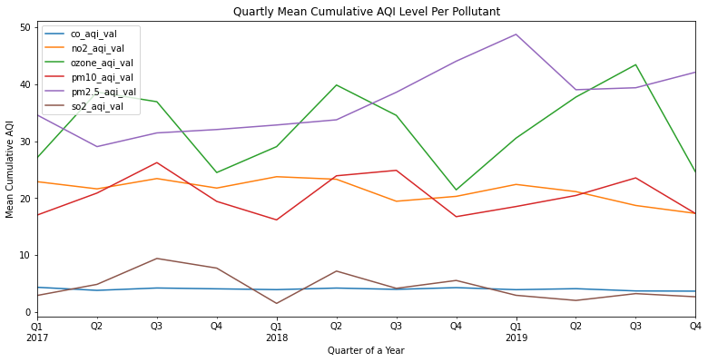
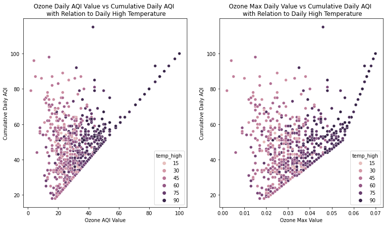
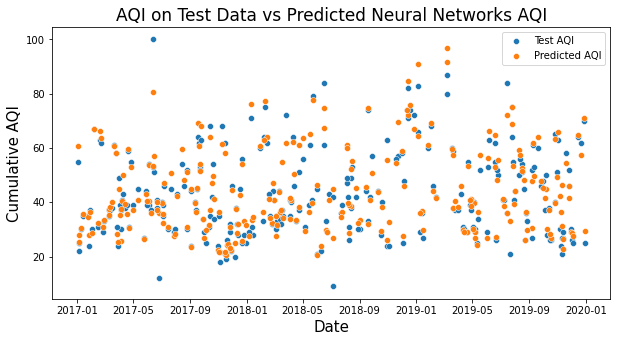
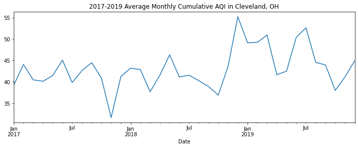
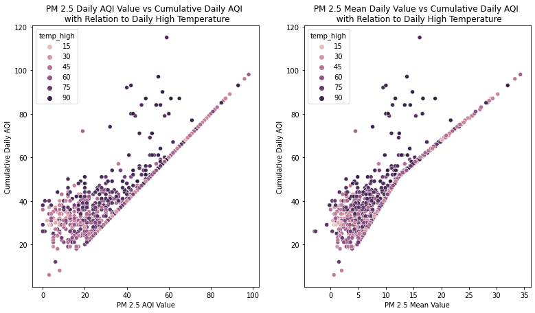
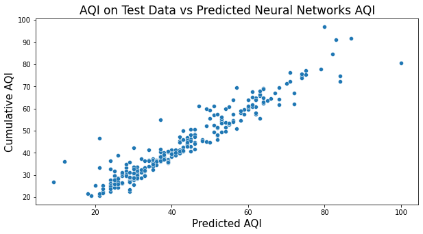

# Project 5
# *Air Pollutants and Air Quality Index*

## Contents
 - [Problem Statement](#Problem-Statement)
 - [Executive Summary](#Executive-Summary)
 - [File Directory](#File-Directory)
 - [Data](#Data)
 - [Data Dictionary](#Data-Dictionary)
 - [Conclusions and Recommendations](#Conclusions-and-Recommendations)
 - [Areas for Further Research/Study](#Areas-for-Further-Research/Study)
 - [Sources](#Sources)
 - [Visualizations](#Visualizations)

## Problem Statement
[back to top](#Project-5)

We plan to explore the relationship between daily pollutant values and daily temperature readings with overall air quality scores. We will base our model on EPA pollutant data and daily temperature reading in Cleveland, OH from 2017-2019. Our goal is to create an application to help accurately predict a daily air quality index for the residents of Cleveland, OH with the hopes of giving guidance for residents suffering from respiratory illnesses.

## Executive Summary
[back to top](#Project-5)

Through exploratory analysis of CDC and EPA data we wanted to evaluate a model that could be helpful for analyzing air pollutants with the thought of creating information for people with respiratory illness.

Through our preliminary analysis from CDC data, we investigated cities with high asthma rates. We discovered that Cleveland, Ohio resulted in the highest percentage of adults with asthma in the United States in 2017. Knowing that increasing Air Quality Index (AQI) can negatively impact people with respiratory illensses, we wanted to evaluate the realtionship with air pollutants, temperature, day of the week, and month to see if we could identify any relationship to overall daily air quality data (from the EPA website).

With the hopes to create a predictive AQI model, we experimented with Forecasting Machine Learning Models, but the data was too volatile to predict with this type of model. 

Therefore, we looked at Linear Regression, Neural Networks, and Tree Regressor Models to evaluate important features involved with overall Air Quality Information and to create a Streamlit Application that can relay this to at-risk groups. 

## File Directory
[back to top](#Project-5)

05-Project 
| 
|__ code 
|&nbsp;&nbsp;&nbsp;&nbsp;|__ 00_table_of_contents.ipynb  
|&nbsp;&nbsp;&nbsp;&nbsp;|__ 01_cleaning.ipynb  
|&nbsp;&nbsp;&nbsp;&nbsp;|__ 02_eda.ipynb  
|&nbsp;&nbsp;&nbsp;&nbsp;|__ 03_eda_visualizations.ipynb  
|&nbsp;&nbsp;&nbsp;&nbsp;|__ 04_modelling_with_regression.ipynb  
|&nbsp;&nbsp;&nbsp;&nbsp;|__ 05_modelling_with_time_series.ipynb  
|&nbsp;&nbsp;&nbsp;&nbsp;|__ 06_production_model.ipynb  
|&nbsp;&nbsp;&nbsp;&nbsp;|__ 07_streamlit_app.ipynb  
|&nbsp;&nbsp;&nbsp;&nbsp;|__ 08_conclusion.ipynb  
| 
|__ data  
|&nbsp;&nbsp;&nbsp;&nbsp;|__ 2017-2019_aqi_and_temp.csv  
|&nbsp;&nbsp;&nbsp;&nbsp;|__ 2017_all_cleveland_oh_CO.csv  
|&nbsp;&nbsp;&nbsp;&nbsp;|__ 2017_all_cleveland_oh_NO2.csv  
|&nbsp;&nbsp;&nbsp;&nbsp;|__ 2017_all_cleveland_oh_O3.csv  
|&nbsp;&nbsp;&nbsp;&nbsp;|__ 2017_all_cleveland_oh_Pb.csv  
|&nbsp;&nbsp;&nbsp;&nbsp;|__ 2017_all_cleveland_oh_PM10.csv  
|&nbsp;&nbsp;&nbsp;&nbsp;|__ 2017_all_cleveland_oh_PM2.5.csv  
|&nbsp;&nbsp;&nbsp;&nbsp;|__ 2017_all_cleveland_oh_SO2.csv  
|&nbsp;&nbsp;&nbsp;&nbsp;|__ 2018_all_cleveland_oh_CO.csv  
|&nbsp;&nbsp;&nbsp;&nbsp;|__ 2018_all_cleveland_oh_NO2.csv  
|&nbsp;&nbsp;&nbsp;&nbsp;|__ 2018_all_cleveland_oh_O3.csv  
|&nbsp;&nbsp;&nbsp;&nbsp;|__ 2018_all_cleveland_oh_PM10.csv  
|&nbsp;&nbsp;&nbsp;&nbsp;|__ 2018_all_cleveland_oh_PM2.5.csv  
|&nbsp;&nbsp;&nbsp;&nbsp;|__ 2018_all_cleveland_oh_SO2.csv  
|&nbsp;&nbsp;&nbsp;&nbsp;|__ 2019_all_cleveland_oh_CO.csv  
|&nbsp;&nbsp;&nbsp;&nbsp;|__ 2019_all_cleveland_oh_NO2.csv  
|&nbsp;&nbsp;&nbsp;&nbsp;|__ 2019_all_cleveland_oh_O3.csv  
|&nbsp;&nbsp;&nbsp;&nbsp;|__ 2019_all_cleveland_oh_PM10.csv  
|&nbsp;&nbsp;&nbsp;&nbsp;|__ 2019_all_cleveland_oh_PM2.5.csv  
|&nbsp;&nbsp;&nbsp;&nbsp;|__ 2019_all_cleveland_oh_SO2.csv  
|&nbsp;&nbsp;&nbsp;&nbsp;|__ cleaned_aqi_and_temp_data_2017-2019.csv  
|&nbsp;&nbsp;&nbsp;&nbsp;|__ ClevelandOHweather2017.csv  
|&nbsp;&nbsp;&nbsp;&nbsp;|__ ClevelandOHweather2018.csv  
|&nbsp;&nbsp;&nbsp;&nbsp;|__ ClevelandOHweather2019.csv  
|&nbsp;&nbsp;&nbsp;&nbsp;|__ combo_df.csv  
| 
|__ images  
|&nbsp;&nbsp;&nbsp;&nbsp;|__ mean_aqi_polut.png  
|&nbsp;&nbsp;&nbsp;&nbsp;|__ monthly_aqi.png  
|&nbsp;&nbsp;&nbsp;&nbsp;|__ ozone_and_temp.png  
|&nbsp;&nbsp;&nbsp;&nbsp;|__ PM_2.5_temp.png  
|&nbsp;&nbsp;&nbsp;&nbsp;|__ pred_vs_test_aqi_2.png  
|&nbsp;&nbsp;&nbsp;&nbsp;|__ pred_vs_test_aqi_neural.png  
|&nbsp;&nbsp;&nbsp;&nbsp;|__ streamlit_app.png  
| 
|__ models  
|&nbsp;&nbsp;&nbsp;&nbsp;|__ neural_net_model12.h5  
|&nbsp;&nbsp;&nbsp;&nbsp;|__ neural_net_model12_raw.h5  
| 
|__ presentation  
|&nbsp;&nbsp;&nbsp;&nbsp;|__ presentation.pdf  
|&nbsp;&nbsp;&nbsp;&nbsp;|__ presentation.pptx  
| 
|__ Streamlit  
|&nbsp;&nbsp;&nbsp;&nbsp;|__ airquality.jpeg  
|&nbsp;&nbsp;&nbsp;&nbsp;|__ app.py  
|&nbsp;&nbsp;&nbsp;&nbsp;|__ app1.py  
|&nbsp;&nbsp;&nbsp;&nbsp;|__ clean_aqi.csv  
|&nbsp;&nbsp;&nbsp;&nbsp;|__ galogo.jpeg  
| 
|__ README.md  
|__ LICENSE  

## Data
[back to top](#Project-5)

Data about pollution and AQI values per pollutant were pulled from the [Download Daily Data](https://www.epa.gov/outdoor-air-quality-data/download-daily-data) section of the [EPA website](https://www.epa.gov/). All data was observed at the George T. Craig National Core (NCore) Monitoring Station in Cleveland, Ohio during 2017, 2018, and 2019.

Temperature data about Cleveland, Ohio was taken from the [Cleveland.com website](https://www.cleveland.com/datacentral/2008/09/cleveland_weather_history_find.html).

*(Please see the __[Sources](#Sources)__ section below for all of the sources we used to make informed decisions about using this data.)*

### Cleaning the Data
We cleaned the data after gathering it, which includes six CSV Files with daily pollutant measures, per pollutant, per year (2017 to 2019), as well as three CSV files with High and Low temperatures observed daily for each of the same years (seven files per year). All data was observed in Cleveland, OH.

Looking over tables, we found that "Site Name" GT Craig NCore seems to have the most data. We also noticed that the device used (or "POC") for PM10 and PM2.5 that is labeled "3" has the most data, and all other pollutants have their best "POC" labelled as "1". This what we used for our data set.

After cleaning up one year's worth of data for pollutants, we decided it would be best to get more data; We pulled two more years worth of data in addition to our 2017 data (that is, we added 2018, and 2019 to our data set). Luckily, the best Site and devices ("POC"s) were consistent with the 2017 data.

We wrote and ran a function to "automate" the cleaning process and extract the most useful information. The function then made this data accessible so we could later add it to a single, larger data set.

We then took our cleaned and simplified 2017 data describing pollutants at "GT Craig NCore" and merged it with the temperature data. And since we already had the data for pollutants for 2018 and 2019, we gathered temperature data for those years, imported/cleaned it, and added it all together. This created one simplified DataFrame with our daily Air Quality measurements, Indices, and the Temperature, from 2017 through 2019.

## Data Dictionary
[back to top](#Project-5)

| Feature            | Python Type | Data Type  | Descritpion   |
| ---                | ---         | ---        | ---           |
| date (index)       | datetime    | Continuous | Date when observations were made  |
| high_temp          |   int64     | Continuous | Highest Temperature measured for the day (in degrees Fahrenheit) |
| low_temp           |   int64     | Continuous | Lowest Temperature measured for the day (in degrees Fahrenheit) |
| co_max             | float64     | Continuous | Amount of Carbon Monoxide measured in ppm |
| co_aqi_val         | float64     | Continuous | AQI value of Carbon Monoxide |
| no2_max            | float64     | Continuous | Amount of Nitrogen Dioxide measured in ppb |
| no2_aqi_val        | float64     | Continuous | AQI value of Nitrogen Dioxide |
| ozone_max          | float64     | Continuous | Amount of Ozone measured in ppm |
| ozone_aqi_val      | float64     | Continuous | AQI value of Ozone |
| pm10_mean          | float64     | Continuous | Average amount of 10um Particulate Matter measured in ug/m3 |
| pm10_aqi_val       | float64     | Continuous | AQI value of 10um Particulate Matter |
| pm2.5_mean         | float64     | Continuous | Average amount of 2.5um Particulate Matter measured in ug/m3 |
| pm2.5_aqi_val      | float64     | Continuous | AQI value of 2.5um Particulate Matter |
| so2_max            | float64     | Continuous | Amount of Sulfur Dioxide measured in ppb |
| so2_aqi_val        | float64     | Continuous | AQI value of Sulfur Dioxide |
| cumulitive_aqi     | float64     | Continuous | Calculated AQI for the day by taking the maximum value from all pollutants |
| pct_change_aqi     | float64     | Continuous | Percent changed in AQI from previous day |
| average_daily_temp | float64     | Continuous | Calculated Average Temperature (in degrees Fahrenheit; Mean of Highest and Lowest Temperatures) |
| month              | float64     | Nominal    | Month denoted by numeric value one through twelve |
| weekday            | float64     | Nominal    | Day of the week, assuming the week starts on Monday, which is denoted by 0 and ends on Sunday which is denoted by 6 |

## Conclusions and Recommendations
[back to top](#Project-5)

Through EDA and modelling we were able to identify important features for air quality that impacted overall Air Quality Index (AQI). The features that influenced the AQI the most appeared to be Ozone and PM2.5 (see image below).

We also discovered a relationship with increased temperature and ozone levels, there tends to be increased AQI values as well (see image below).

We looked at Forecasting, Regression, and Neural Network models to analyze our data and see which was able to give the best description of our features and observations and possibly predict. 

Forecasting failed to create an accurate predictive model since the daily data is rather volatile, and the Forecasting models generally either performed as well as the baseline or not well at all. 

We explored several Regression Models, but the Decision Tree Regressor performed the best from that category.  The Decision Tree model performed with a R2 score of 0.7863 and a Root Mean Square Error of 7.1915.

Although Linear Regression and Decision Tree Regressor models performed well, Neural Networks proved to be the best model. The Neural Networks model performed with a R2 score of 0.8973 and a Root Mean Square Error of 4.9850. The graph below demonstrates how our predicted AQI values align closely with the observed values from our test set.

Regression and Neural Network models demonstrated relationships among pollutants regarding overall AQI. Across all models it became apparent that PM2.5 and Ozone were major contributors in predicting the overall Air Quality Index.

We recommend that sensitive groups (those with COPD, Asthma, or other respiratory illnesses) should pay special attention to Ozone and PM2.5 levels since they have the highest detriment to overall Air Quality. We also recommend local and state governments to implement stricter anti-pollution measures to accomodate better Air Quality for their citizens.

## Areas for Further Research/Study
[back to top](#Project-5)

While not perfect, what we have started with has given a solid foundation to improve upon. The Nueral Net model created has the potential to become better with more data, and with the possibility of using data that includes extreme conditions, whether hypothetical or factual. As with many other models, collecting more data to train our model would likely show an improvement, and there is plenty of data to use for this topic, both within the features investigated, as well as looking for new features to incorporate.

With more data, we could circle back and reevaluate the use of other predictive models, such as Regression and Time Sereies models in addition to trying to improve our Nueral Network model. This may even present an opportunity to try fitting some Ensemble models as well.

A constraint we encountered was the limitation of storage and computing power when deploying our model within a Streamlit app to Heroku. As a free online deployment tool, Heroku allowed us to get our app deployed, but with an amount of difficulty that would not be encountered if Hosted with a cloud service like EC2 with Amazon Web Services.

Another way to add more to our research would involve taking pollutant readings from websites and RSS feeds in realtime to help add information to our model, as well as sending it to our Streamlit application for ease of use. This process can even be automated on an EC2 instance with a time-based job-scheduler like cron-job. 

Another possibility would be deploying different models to different users. With the users consent, more data about how well the model predicted could be returned to the backend for future analysis. The user could also give feedback in regard to their enjoyment of the application. 

This project has lots of versatility, and by building a decent foundation with one city, it makes it possible to implement this in other areas of Cleveland, or other parts of Ohio, the United States, or even the world.

## Sources
[back to top](#Project-5)

https://www.epa.gov/outdoor-air-quality-data/download-daily-data  
https://www.cleveland.com/datacentral/2008/09/cleveland_weather_history_find.html  
https://www.airnow.gov/sites/default/files/2020-05/aqi-technical-assistance-document-sept2018.pdf  
https://www.epa.state.oh.us/portals/27/ams/plans/NCORE-GTCraig.pdf  
https://www.breeze-technologies.de/blog/what-is-an-air-quality-index-how-is-it-calculated/  

## Visualizations
[back to top](#Project-5)

